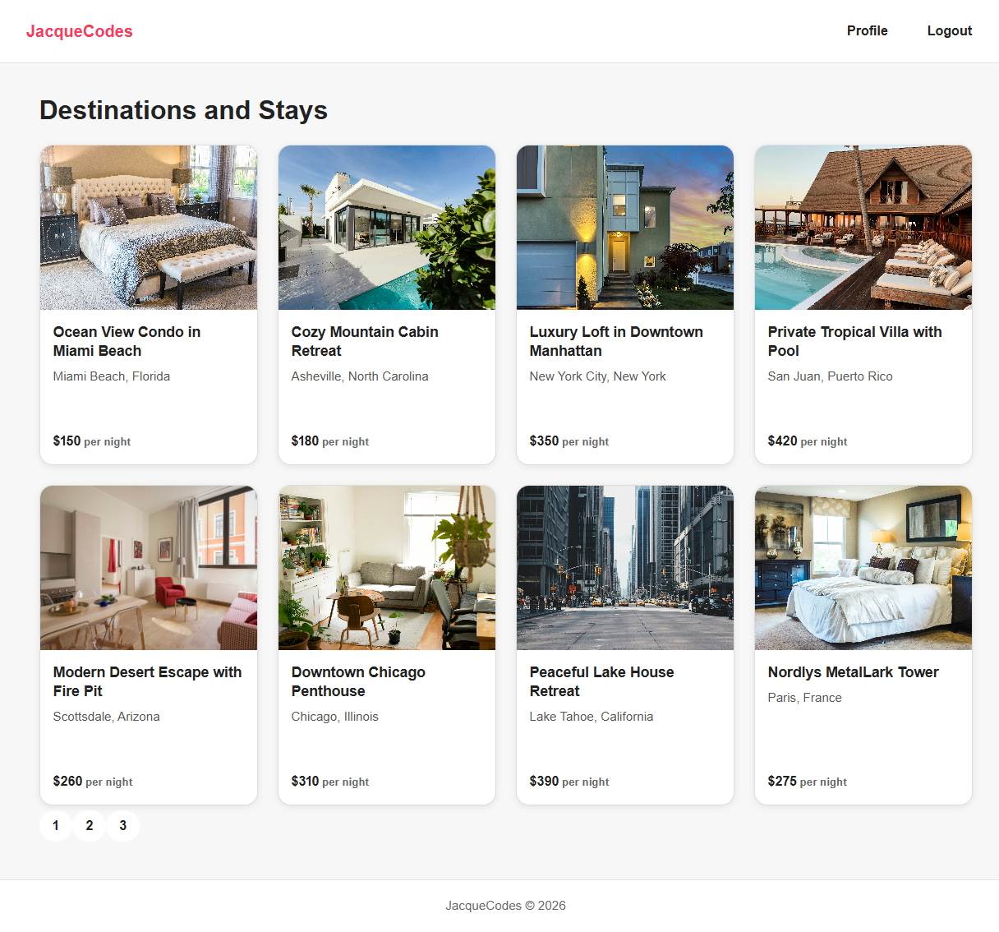
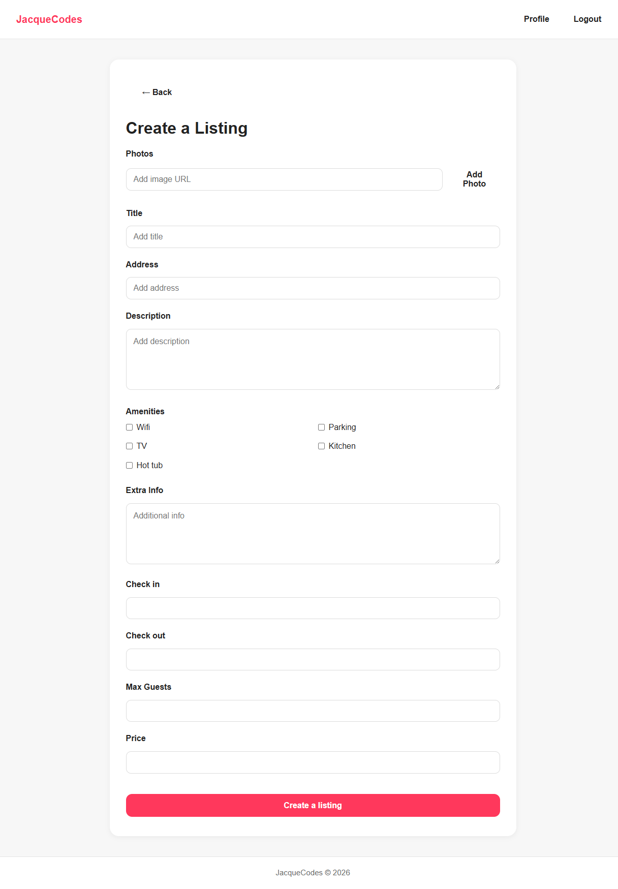
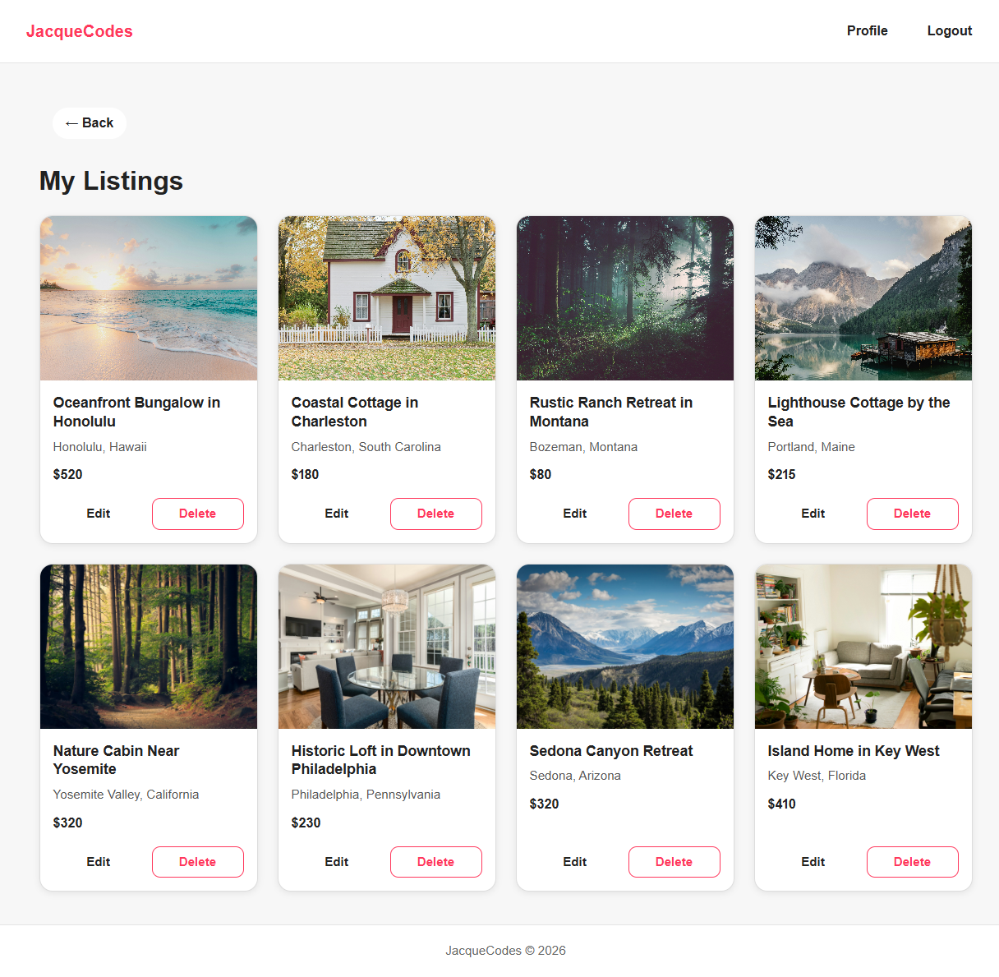
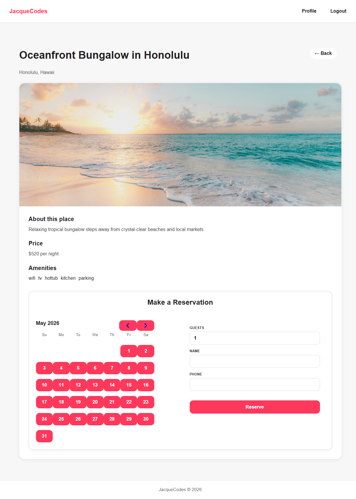
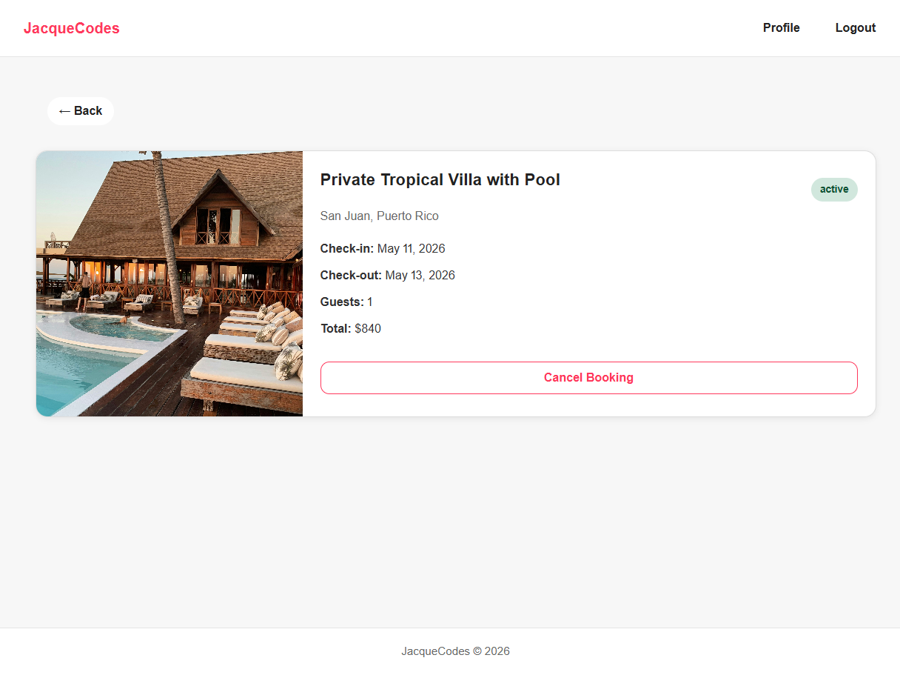

# Airbnb Clone Frontend

This is the frontend for my Airbnb Clone project, built with React and Vite. It is part of a polyrepo full-stack architecture, where the frontend and backend are maintained in separate repositories and communicate via RESTful APIs.

---

## Screenshots

### Homepage



### Listing From Page



### My Listings Page



### Booking Page



### Booking Detail Page



---

## Current Project Status

At this stage, the frontend includes:

- React application initialized with Vite
- Production-style folder structure with separation of concerns
- React Router configuration with nested routing
- Shared layout using Header, Footer, and Outlet
- Navigation with active route styling using `NavLink`
- Centralized Axios API client with credential support
- Environment-based backend URL configuration using Vite `.env`
- RESTful frontend-to-backend API integration
- Fully functional user registration flow
- Fully functional user login flow with cookie-based authentication
- Full booking system with reservation management
- Booking cancellation flow
- Pagination system for listings
- Auto-login after successful registration
- Reusable back button navigation
- Responsive booking and listing layouts

---

## Tech Stack

- React
- Vite
- React Router DOM
- Axios
- CSS
- React DayPicker

---

## Folder Structure

```text
src
├── api
│   └── api.js
├── assets
├── components
│   ├── Footer.jsx
│   ├── Header.jsx
│   ├── Layout.jsx
│   └── ProtectedRoute.jsx
│   └── Loading.jsx
├── context
│   └── AuthContext.jsx
|   |__ AuthProvider.jsx
├── pages
│   ├── HomePage.jsx
│   ├── LoginPage.jsx
│   ├── RegisterPage.jsx
│   ├── ProfilePage.jsx
│   ├── AddPlacePage.jsx
│   ├── EditPlacePage.jsx
│   ├── UserPlacesPage.jsx
│   └── PlaceDetailsPage.jsx
│   ├── BookingPage.jsx
│   └── BookingDetailPage.jsx
├── routes
│   └── AppRoutes.jsx
├── App.jsx
└── main.jsx
├── App.css
└── index.css
```

---

## Features Implemented

### Booking System

#### Create Booking

- Authenticated users can reserve listings
- Booking form with controlled inputs
- Dynamic total price calculation
- Validation for check-in/check-out dates
- Prevents unauthenticated booking attempts

#### Booking Management

- Fetch authenticated user bookings
- Booking detail page
- Booking cancellation system
- Status tracking (active/cancelled)
- Responsive booking card layout

### Authentication System

- User registration and login with controlled React forms
- JWT-based authentication using HTTP-only cookies
- Session persistence across page refresh
- Logout functionality with cookie clearing
- Global auth state managed via Context API

### Routing Architecture

- Nested routing using React Router
- Shared layout with Header, Footer, and Outlet
- Protected routes for authenticated pages
- Public routes for listing browsing

### API Layer

- Centralized Axios instance (api.js)
- Dynamic base URL using environment variables
- withCredentials: true for secure cookie-based authentication

### Listings (Places) System

### Booking System

#### Create Booking

- Reservation form on listing details page
- Controlled booking form inputs
- Dynamic total price calculation
- Frontend booking validation before submission
- Booking creation via POST /bookings

#### Availability System

- Fetch active booking ranges for a listing
- Frontend overlap validation
- Backend overlap enforcement
- Disabled unavailable dates using React DayPicker
- Prevents double bookings

#### Booking Management

- User bookings page
- Individual booking details page
- Booking cancellation flow
- Dynamic status updates (active / cancelled)
- Cancelled bookings reopen availability

#### - Create Listing

- Controlled form with dynamic state management
- Photo URL input with add/remove functionality
- Amenities selection using checkbox system
- Form validation before submission
- POST request to /places

### Edit Listing

- Pre-filled form using fetched data
- Controlled updates with PATCH requests
- Dynamic state hydration from backend
- Photo management (add/remove)

### Delete Listing

- Delete action with confirmation prompt
- Optimistic UI update using state filtering
- DELETE request to /places/:id

### User Listings Dashboard

- Fetches authenticated user listings (/places/user-places)
- Displays listings in responsive card layout
- Conditional rendering (loading, empty state, data)
- Skeleton loading UI for improved UX

### Listing Details Page

- Dynamic route: /places/:id
- Fetch single listing by ID
- Displays:
  - Title
  - Address
  - Main image
  - Description
  - Price
  - Amenities
- Handles loading and error states

### UI/UX Enhancements

- Skeleton loading states for data fetching
- Hover interactions and clickable cards
- Button interaction feedback (hover/transform)
- Responsive card layouts
- Clean form structure and spacing
- Reusable styling system
- Responsive booking calendar UX
- Disabled submit states during async operations
- Success and error feedback messaging
- Availability-aware reservation flow
- Unified reusable card design system

### What I Learned

- Building production-style React architecture
- Managing global vs local state (Context vs component state)
- Handling authentication with cookies and protected routes
- Designing scalable folder structures
- Implementing full CRUD flows in frontend
- Managing controlled forms and complex state updates
- Handling async data fetching and loading states
- Understanding event bubbling and stopPropagation
- Designing user-friendly UI/UX patterns
- Implementing frontend + backend availability systems
- Date overlap validation logic
- Responsive UI architecture
- Calendar-based booking UX
- Production-style form state management
- Real-world async UX patterns

### API Relationship Example

- Frontend request → /places/:id
- Backend mount → app.use("/places", placeRoutes)
- Route definition → router.get("/:id")
- Final endpoint → /places/:id

### How to Run the Frontend

1. Install dependencies:

```
npm install
```

2. Create a .env file in the root:

```
VITE_API_URL=http://localhost:5000
```

3. Start development server:

```
npm run dev
```

### Important Notes

- .env is excluded from version control
- node_modules is ignored
- Frontend and backend are separate repositories (polyrepo setup)
- Backend must be running for API requests to succeed

### Next Steps

- Full mobile responsiveness polish
- Search and filtering system
- Image upload/cloud storage integration
- Favorites/wishlist system
- Review and rating system
- Map integration
- Deployment (Vercel + Render)

### Deployment Architecture

- Frontend deployed on Vercel
- Backend deployed on Render
- MongoDB Atlas for database hosting
- Environment variables used for secure configuration
- Cross-origin cookie authentication configured with CORS

## Author

Jackson Jacque |
Full Stack MERN Developer
